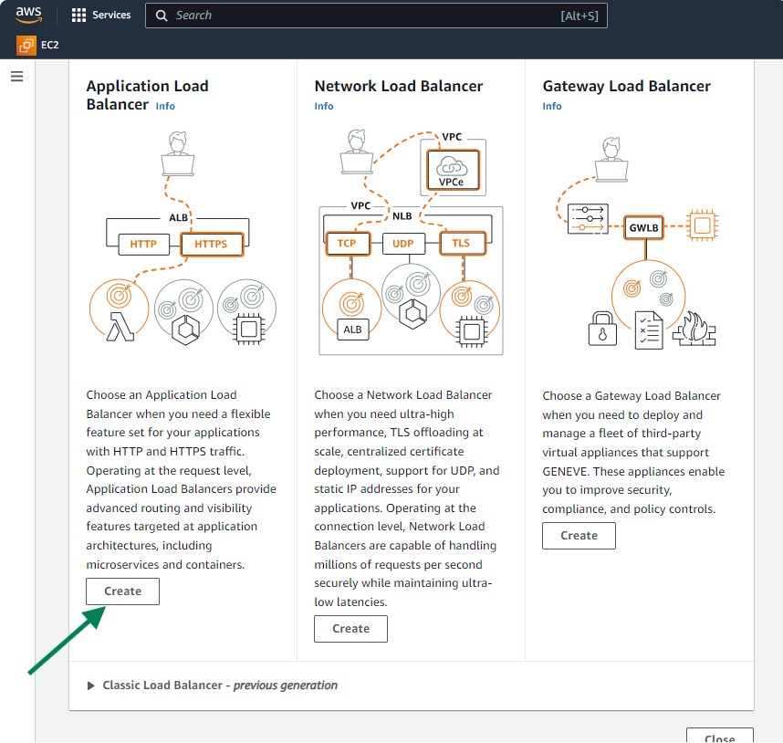

# Load Balancer and Auto-Scaling Group in AWS

## What is High Availability?

High Availability refers to a system or service that's always up and running, without any significant downtime. It's like having a reliable friend who's always there when you need them. In tech terms, this means designing systems in a way that minimizes the chances of failure. For example, if one part of the system goes down, there's another backup ready to take over immediately, like a spare tire in a car.
High Availability ensures that even if something breaks, the overall service remains accessible and reliable for users.

## What is Scalability?

Scalability is like being able to handle growth without breaking a sweat. Imagine you have a small bakery, and suddenly, you get a lot more customers than expected. Scalability means you can quickly bake more bread and pastries without the bakery falling apart. In tech, it's similar to set up your systems so that they can handle more and more users or customers without crashing or slowing down. So, whether it's adding more servers to your website during a big sale or making sure your app can handle a sudden surge in downloads, scalability ensures everything runs smoothly.

Let's understand some terms before going ahead with our practical.

1. **Server:** It's like a big computer that stores and shares stuff, like websites or apps, with other computers.
2. **Client:** This is your computer or phone, asking the server for stuff, like loading a web page or using an app. 
3. **Traffic:** Think of the "busy road" as the network infrastructure, like highways and streets, that connects servers (where websites and apps are hosted) to clients (like your computer or phone). It's where data packets travel back and forth, carrying information between the servers and the clients.
4. **Redundancy:** This is like having backups for important stuff, just in case something breaks. It's like having spare parts for your bike so you can keep riding even if something breaks.
5. **Server Load:** Imagine a server like a superhero carrying heavy bags of data. Server load is like how heavy those bags are. Too many bags can slow the superhero down!
6. **Routing:** Routing refers to the process of determining the best path for data packets to travel from their source (like a server) to their destination (like a client device). It's like finding the most efficient route on a map to reach your destination while avoiding traffic jams and roadblocks. Routing ensures that data packets reach their intended destination quickly and reliably across the network. 

## What is Load balancer?

Imagine you have a popular restaurant with only one cashier. As the day goes on, more and more customers start coming in, lining up to place their orders. Eventually, the line gets so long that customers become frustrated, some may even leave without ordering, and the cashier gets overwhelmed trying to handle all the orders.

A load balancer is like adding more cashiers to the restaurant to help manage the increasing number of customers. It's a specialized device or software that evenly distributes incoming network traffic or workload across multiple servers or resources.

So you can say that a load balancer helps spread the workload across several servers, ensuring that no single server gets overwhelmed with too much traffic or requests. This not only improves the performance and response time of the system but also increases its reliability and availability. If one server goes down, the load balancer can redirect traffic to the remaining servers, minimizing downtime and ensuring that the service remains operational.

**Why is a load balancer important, and what could happen if we don't use it?**

Imagine your website is like a bustling restaurant, and each visitor is a hungry customer lining up to place an order. Just like how a single cashier would struggle to handle a long line of customers, a single server for your website would struggle to handle too many visitors at once.

That's where the load balancer comes in! It's like hiring extra cashiers for your restaurant. The load balancer helps spread out all those incoming visitors across multiple servers, so no single server gets overwhelmed. This keeps things running smoothly, and visitors don't have to wait forever to see your website.

But what if you didn't have a load balancer? Well, it'd be like trying to run your restaurant with just one cashier on a super busy day. The line would get longer and longer, customers would get frustrated and might leave without ordering. And worst of all, your cashier would be stressed out and might even crash under the pressure.

Similarly, without a load balancer, your website could slow down or even crash when too many people try to visit it at once. Visitors would get error messages instead of seeing your wesome website, and you could end up losing customers and business.

So, in simple terms, a load balancer is like having extra cashiers for your website, making sure everything runs smoothly even when lots of people are trying to visit it at the same time.

### Types of Load balancer

In AWS, there are mainly four types of load balancers:
1. Application Load Balancer
2. Network Load Balancer
3. Classic Load Balancer
4. Gateway Load Balancer

In this project, we will exclusively focus on the Application Load Balancer.

### What is an Application Load Balancer**

Imagine you have a website that's getting a lot of visitors. When someone visits your website, their request needs to be sent to one of your website's servers to show them the webpage they want. Now, if you have multiple servers running your website, you need a way to decide which server should handle each request.
That's where an Application Load Balancer (ALB) comes in.

Think of an ALB as a traffic cop for your website. It sits in front of your servers and receives all the incoming requests from users. When a user wants to visit your website, their request goes to the ALB first.

But how does the ALB decide which server should handle each request? It uses a set of rules that you define. These rules can be based on things like the URL the user wants to visit, the type of request (like HTTP or HTTPS), or even custom conditions you specify. 

Once the ALB decides which server should handle the request, it sends the request to that server. This helps distribute the incoming traffic evenly among all your servers, so no single server gets overloaded.

But ALBs don't just send requests to servers blindly. They also monitor the health of your servers. If a server goes down or becomes unhealthy for some reason, the ALB stops sending requests to that server until it's back up and running properly. This helps ensure that your website stays reliable and available even if one of your servers has issues.

An Application Load Balancer (ALB) works at Layer 7 of the OSI model, which is the application layer. This is what makes it different from other load balancers.
Because it works at Layer 7, the ALB can make smart decisions based on the actual content of the web traffic. For example, if a request comes in for
"www.gatogrowfast.net/login," the ALB can send it to a server that handles login requests. If another request comes in for "www.gatogrowfast.net/shop," it can route that to a different server that deals with the shopping section. This ability to understand and manage different types of traffic helps improve howwell your applications run.

So, in simple terms, an Application Load Balancer is like a traffic cop for your website, directing incoming requests to the right servers based on predefined rules, and making sure everything runs smoothly and effciently.

Note- The OSl model is a framework used to understand how different network protocols interact. It has seven layers: Physical, Data Link, Network, Transport, Session, Presentation, and Application. Each layer has a specific role, like how data is transmitted, routed, and presented to users. The Application Load Balancer (ALB) - operates at the Application layer (Layer 7), allowing it to make decisions based on the content of the data.

Let's take a look at a few terms that will help you grasp Auto Scaling Groups easily.

**Scaling:** Scaling refers to adjusting the size of something to meet changing needs.
In the context of technology, like with websites or apps, scaling means adding more resources, like servers, when there's lots of demand, and removing them when demand goes down. It's like having more waiters in a restaurant during busy times and fewer when it's quiet, so customers don't have to wait too long to be served.

**Scaling Out:** When things get busy, scaling out means adding more helpers to handle the work. It's like calling in extra staff at a restaurant when there's a rush of customers. This helps keep things running smoothly and prevents long waits. So Scaling Out refers to increasing the number of instances in response to increased demand or workload.

**Scaling In:** On quieter days, scaling in means sending some of the extra helpers home. It's like letting staff go home early when the restaurant isn't as busy. This saves money and makes sure you're not paying for more help than you need. So Scaling In refers to decreasing the number of instances when the demand or workload decreases.

**Auto scaling:** Auto scaling means automatically adjusting the number of servers or * resources based on changing demand or workload. It's like having a smart system that adas more waiters to a restaurant when it gets busy and sends them home when it's quiet, without needing someone to do it manually. This helps ensure that websites or apps can handle varying levels of traffic efficiently and cost-effectively.

### What is an Auto-Scaling group in AWS?

Think of an Auto Scaling Group in AWS like a team of workers ready to help out when things get busy. You tell AWS how many workers you need at different times, and it automatically aads or removes them based on how much work there is. So, if your website suadenly gets lots of visitors, AWS will quickly add more servers to handle the traffic. And when things calm down, it'll send some servers home to save money. It's like having a flexible workforce that grows and shrinks with your needs, ensuring your website stays up and running smoothly with minimal effort on your part.

Let's move on to the practical aspect. Well split it into two parts. Part 1 will cover setting up the Application Load Balancer, and Part 2 will focus on configuring the Auto Scaling Group.

### Part - 1

We have created some EC2 instances.

And these instances contain some website having the below content.

In a real-world scenario, all targets would typically have the same data. But here we've added different data to each of the three target instances to show how the load balancer connects to all of them.

After that,

A - Creating Target groups -
1. First, navigate to the AWS console

a) Then, locate the EC2 service by using the search fuction.

a) Then click on "EC2"

2. Now, scroll down until you locate the target groups. Click on it.

a) The select the option to create a new target group.

3. Choose instances as a target type.

4. Now, provide a name for your target group.

a) Set the protocol to HTTP

b) Choose port no. as 80

c) Select "IPv4" as the IP address type.

d) Next, select the the VPC that you previously created in your project fromt eh available options.

e) Keep all setttings at their default values and proceed by clicking on the "Next" button.

5. Now, choose the instances that you've created to serve as targets for the application load balancer.

a) Now, click on "include as pending below".

b) Now, click on "Create target group".

Your target group is being successsfully created.

B - Creating Load balancer
1. On EC2 page, scroll down until you locate the Load Balancer service. Click on it.

a) Then select the option to create a new load balancer.

2. After selecting to create a new load balancer, proceed by choosing the "Create" option specifically for the Application Load Balancer.

3. Enter the name of your load balancer, ensuring it reflects its purpse clearly.

a) Then select "Internet-facing" as the scheme.

b) Choose "IPv4" as the IP address type.

c) Select the VPC you created in the previous project.

d) Select the AZ and choose the public subnet there.

As in our Previous VPC project, we have created only one public subnet but here while creating load balancer, we need at least two public subnets in different AZ's, so now you are aware of how to create subnet and how to do subnet association for route table, so first do that part by right clicking on the tab where you currently are and open a duplicate tab and then on that duplicate tab first create the subnet and attach the route table with that subnet in which we have provided the way how to connect to internet gateway. and then process with this load balance part on the previous tab.

**Note:** your subnet will not be considered as public subnet until you associate the route table which we have given the path for internet gateway so make sure to do that part.

a) For now, use the default security group as it is.

b) Here select the Target group you have created just before in Part-1.

c) Now leave everything as it is and click on create load balancer.

Your application load balncer has been created successfully.

After creating the ALB (Application Load Balancer), go to target groups section and check the health of your instances.

**Note:** If you notice that all instances are marked as unhealthy orif any individual instance is deemed unhealthy, it's essential to first verifyy connectivity. You can do this by attempting to ping the instances to confirm network reachability.

To troubleshoot, follow these steps:

1. Search for "Command Prompt" on your laptop.

2. Copy the public IP addresses of the instances.

3. Open Command Prompt and type:

`ping <Public IP of instance>`

It appears that We're currently unable to establish a connection to the instance using its public IP address. If you're able to successfully connect to the instances via their public IP addresses, it confirms that there's connectivity to them. In that case, if the instances are still marked as unhealthy in the load balancer, you may need to investigate further to determine the root cause of the issue.

Let's see some of the thing you need to keep in mind,

**Security Group Configuration:** Make sure that the security groups associated with your instances allow inbound traffic from the Application Load Balancer (ALB) on the necessary ports. Check that the security group rules are correctly configured to allow traffic from the ALB's security group.

**Network ACL Configuration:** If a network ACL (NACL) is attached to the subnet where your target instances ge running, review the inbound and outbound traffic rules of the NACL. Ensure that the NACL is not blocking traffic from the ALB or from the internet to the instances.

**Web Server Configuration:** Verify that your web server is configured correctly on your instances. Check that the web server is listening on the correct port and is serving the correct content. Ensure that there are no misconfigurations or errors in the web server configuration files.

**Firewall Rules:** Check if there are any firewall rules or ip tables rules on the instances that may be blocking incoming traffic. Review the firewall settings to ensure that they allow traffic from the ALB and from the internet.

**Health Check Configuration:** Review the health check settings for your target group. Ensure that the health check path and protocol are configured correctly to match the configuration of your web server. Check that the health check endpoint is accessible and returning the expected response.

**Instance Status:** Verify the status of your instances in the EC2 dashboard.
Ensure that the instances are running and reachable within your VPC. If there are any issues with the instances themselves, troubleshoot and resolve them accordingly.

If you're seeing this type of output, it indicates that the connectivity has been established.

Currently, our actual output indicates that all instances are healthy.

Now,

4. Form the Load Balancer page, copy the DNS of the load balancer.

5. Paste it into a new tab within your chrome browser.

You'll notice that the load balancer is evenly distributing the workload across all three instances.

Now, let's come to our next part

### Part -2

A- Creating Auto scaling group
1. Go to the search bar on AWS console and search for "Auto Scaling Group". You'll find it there.

a) Click on it.