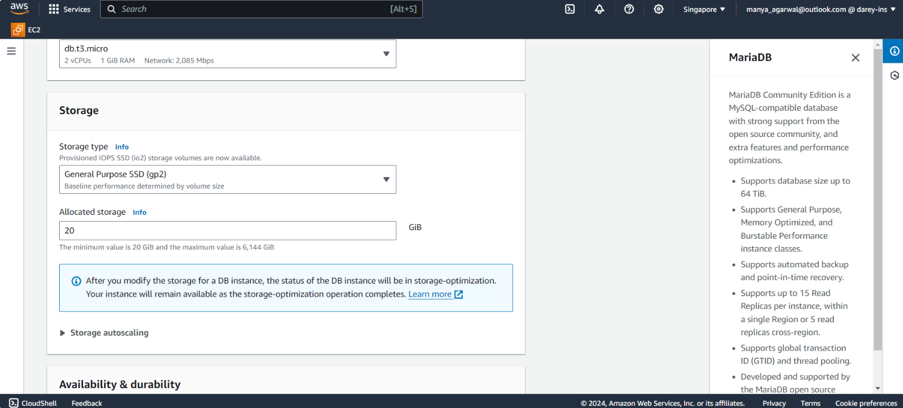
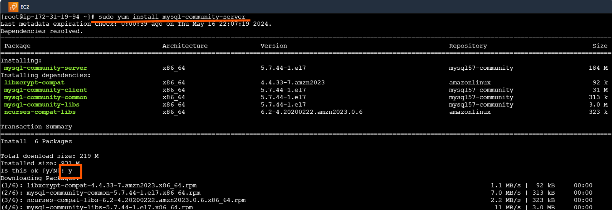

# Database Management with RDS

### What is database?
You can think of a database as a big digital filing cabinet where you can store all kinds of information. Instead of paper files, though, it's all stored on a computer. So, if you have a list of your favorite songs, or a record of all the books in a library, you can keep them organized in a database. It's like having a super organized digital notebook where you can easily find and manage your information.

### What is database management?
Database management is like being the boss of that digital filing cabinet we talked about earlier. It's all about making sure the information in the database is well-organized, secure, and easy to access. So, just like a manager at a company, you're responsible for things like creating and updating records, setting up rules for who can access what, and making sure everything runs smoothly. Think of it as keeping the digital filing cabinet in tip-top shape so that everyone can find what they need without any issues.

### What is a Database management system?
Think of a database as a digital storage space where you keep all your important stuff, like lists of names, numbers, or even pictures. Now, imagine you have a special friend, let's call them a Database Manager, who helps you keep everything tidy and organized in that storage space.

So, Database Management is like having that friend tidy up your digital space, making sure everything is easy to find and use. They organize your stuff neatly, help you add new things, and make sure nothing gets lost or messed up.

Now, think of a Database Management System (DBMS) as the toolbox your friend uses to do all this. It's like a set of special tools and tricks that make organizing and managing your digital stuff super easy. With the DBMS, your friend can quickly search for things, sort them out neatly, and even protect your data from getting messed up or lost. It's like having a magical helper to keep your digital life in order.

### What is Relational Database Management Systems (RDBMS)?
Imagine you're organizing a big treasure hunt with lots of clues hidden everywhere. Each clue is like a piece of information in your database. Now, to manage all these clues effectively, you need a system that keeps everything organized, helps you find the right clues quickly, and ensures that only the right people can access them. That's exactly what a Relational Database Management System (RDBMS) does!

Picture RDBMS as your trusty treasure map maker. It takes all the clues (data) you have and puts them into neat categories, like different types of treasure. Then, it connects these categories together, just like drawing lines on your treasure map to show where each clue leads.

Now, when you need to find a specific clue, RDBMS swoops in like a superhero, quickly locating it for you. And just like a good guard dog, it keeps your treasure safe from any unwanted visitors by controlling who can access it.

### Difference between a Database management system (DBMS) and Database Management System (RDBMS)?
Imagine you're planning a treasure hunt with lots of clues hidden around your backyard. Now, if you're just using your regular old memory to remember where each clue is, that's like using a Database Management System (DBMS). You're doing all the work yourself, trying to keep track of everything without much help. But if you upgrade to a Relational Database Management System (RDBMS), it's like having a super-powered assistant to help you out. This assistant not only remembers where each clue is but also organizes them neatly into categories and draws connections between them. So, when you need to find a specific clue, your assistant can quickly point you in the right direction:

In simple terms, DBMS is like doing the treasure hunt all by yourself, while RDBMS is like having a helpful assistant to make everything easier and more organized.

### Let's come to the practical part,
1. Navigate to the search bar on the AWS console.

a) Input "RDS" to locate the RDS service. Once found, click on the RDS option to proceed.

2. Navigate to the left sidebar and select the "Databases" section.

a) Click on "Create Database" to proceed.

3. Select "Standard create" as the database creation method.

a) Choose the MYSQL engine.

***Note-*** MySQL, PostgreSQL, Amazon Aurora etc. are like digital assistants for organizing your data.They help you store and manage information in an organized way, kind of like keeping your files neat and tidy in a virtual filing cabinet. You can create different categories for your data, like lists of names or numbers, and easily find what you need when you need it.

These tools are called relational database management systems (RDBMS). They're like special software that makes it easy to work with structured data, meaning data that's organized into tables with rows and columns. With RDBMS, you can create databases, define how your data should look, search for specific information, and make sure everything stays Jrganized and secure. It's like having a super-powered organizer for your digital information.

b) Select the latest engine version or any preferred version.

c) Choose a free teir template.

d) Then, specify the DB instance name.

e) Select a master username for your database.

f) Choose "Credentials management" as "Self-managed".

g) Enter the master password for the database and confirm it by re-entring it in the "confirm password" field.

***Note-*** Ensure to record the username and password you entered somewhere safe, like a text editor such as Notepad. Forgetting these credentials could result in being unable to access the database youve created.

h) Choose DB instance class as "db.t3.micro".

i) Please maintain the default settings and other configurations.

j) Choose the Vpc you have created in the previous project.

k) Select "Public access" as "Yes".

***Note-*** While it's generally not recommended to keep your database public for the purpose of this practical exercise, we'll be configuring it as public.

l) Select the option "VPC security group (firewall)" as "Choose existing".

m) Then, choose your pre-created security group in the "Existing VPC security groups" section.

***Note-*** Ensure that your security group attached to database permits inbound traffic on port 3306.

If the security group is not configured, set it up by selecting the attached security group and add on inbound rule for MySQL/Aurora on port 3306, allowing traffic from the 0.0.0.0/0 CIDR range.

n) You can choose any of the Availability zones. Here, we are selecting "ap-southeast-1a".

You can leave the other settings as default.

o) Proceed by selecting the option labeled "Created database" to initiate the creation process.

Typically, creating a database takes some time. To monitor the progress, you can refresh the page periodically by clicking on the refresh button in the designated section as indicated in the image below.

Now, you can observe that the database is available for use.

***Please note:*** If you encounter an error of this nature, attempt to change the password and then proceed with the next steps.

For more clarity about Naming constraints you can go throught the [Naming constraints in Amazon RDS](https://docs.aws.amazon.com/AmazonRDS/latest/UserGuide/CHAP_Limits.html)

4. Proceed by clicking on your database, labeled "my-rds-database".

5. Now, scroll down and on the right side, you will find an endpoint. Copy this endpoint.

Keep this endpoint along with your username and password in a safe place for future reference.

We have already created an EC2 instance with an Amazon Linux image.

After connecting to the instance, execute the following commands:

`sudo wget https://dev.mysql.com/get/mysql57-community-release-el7-11.noarch.rpm`

`sudo yum localinstall mysql57-community-release-el7-11.noarch.rpm`

***Note-*** Whenever prompted, please input "yes" or "no", and type "y" for "yes".

`rpm --import https://repo.mysql.com/RPM-GPG-KEY-mysql-2022`

`sudo yum install mysql-community-server`

`systemctl start mysqld.service systemctl enable mysqld.service systemctl status mysqld.service`

***Please note*** that you can press "q" to quit here after running the status command.

Now, for connecting your RDS to ec2 instance,

**mysql -h [Endpoint] -P [Port] -u [Username] -p[Password]**

In this process, we are executing commands tailored to our specific database configuration. Please ensure you adjust the values to align with your database setup.

mysql -h my-rds-database.chiOoo62ys8d.ap-southeast-1.rds.amazonaws.com -P 3306 -u admin - pgatogrowfast-database

**Note:** Ensure there are no spaces between "-p" and your password. For example, if your password is
"gatogrofast-database," it should be written as "-pgatogrowfast-database".

If you want to view all databases, run:

SHOW DATABASES;

To use the database you have created, execute:

USE mysql;

If you want to show tables inside the database,

SHOW TABLES;

You have successfully set up your database and connected it to youe EC2 instances. Plus you've effortlesslye accessed and explored the database tables. Great job on reaching this important milestone!