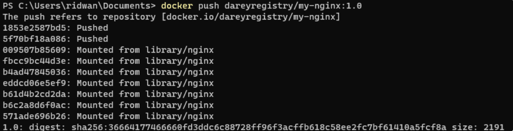

# Docker Images

To explore available images on Docker Hub, the docker command provides a serch subcommand. For instance, to find the Ubuntu image, you can execute:
`docker search ubuntu`

This command allows you to discover and explore various images hosted on Docker Hub by providing relevant search results. In this case, the output will be similar to this:


In the "OFFICIAL" column, the "OK" designation signifies that an image has been constructed and is officially supported by the organization responsible for the project. Once you have identified the desired image, you can retrieve it to your local machine using the "pull" subcommand.

`docker pull ubuntu`

Executing this command will fetch the official Ubuntu image from Docker Hub and store it locally on your machine, making it ready for use in creating containers.


Once the image has been successfully downloaded, you can proceed to run a container using that downloaded image by employing the "run" subcommand. similar to the hello-world example, if an image is not present locally when the **docker run** subcommand is invoked, Docker will automatically download the required image before initiating the container.

To view this list of images that have been downloaded and are available on your local machine, enter the following command:

`docker images`

Executing this command provides a comprehensive list of all the images stored locally, allowing you to verify the presence of the downloaded image and gather information about its size, version, and other relevant details.


## Dockerfile

A docker file is a plaintext configuration file that contains a set of instructions for building a Docker image. It serves as a bluepring for creating a reproducible and consistent environment for your application. Docker files are fundamental to the containerization process, allowing you to define the steps to assemble an image that encapsulates your application and its depenencies.

### Creating a Dockerfile


In this dockerfile file, we will be using an nginx image. "Nginx" is an open source software for web serving, reverse proxying, caching, load balancing, media streaming, and more. It started out as a web server designed for maximum performance and stability.

To create a Dockerfile, use a text editor of your choice, such as vim or nano. Start by specifying a base image, defining the working directory, copying files, installing dependencies, and configuring the runtime environment.

Here's a simple example of a Dockerfile for a html file: Let's create an image with using a dockerfile. Paste the code snippet below in a file named **dockerfile** This example assumes you have a basic HTML file named **index.html** in the same directory as your Dockerfile.

```
# Use the official NGINX base image
FROM nginx:latest

# Set the working directory in the container
WORKDIR  /usr/share/nginx/html/

# Copy the local HTML file to the NGINX default public directory
COPY index.html /usr/share/nginx/html/

# Expose port 80 to allow external access
EXPOSE 80

# No need for CMD as NGINX image comes with a default CMD to start the server
```

Explanation of the code snippet above

1. ***FROM nginx:latest:*** Specifies the official NGINX base image from Docker Hub.

2. ***WORKDIR  /usr/share/nginx/html/:*** Specifies the working directory in the container.

3. ***COPY index.html /usr/share/nginx/html/:*** Copies the local **index.html** file to the NGINX default public directory, which is where NGINX serves static content from.

4. ***EXPOSE 80:*** Informs Docker that the NGINX server will use port 80. This is a docoumentation feature and doesn't actually publish the port.

5. ***CMD:*** NGINX images come with a default CMD to start the server, so there's no need to specify it explicitly.

HTML file named **index.html** in the same directory as your dockerfile.

`echo "Welcome to Darey.io" >> index.html`

To build an image for this Dockerfile, navigate to the directory containing the file and run:

`docker build -t dockerfile .`


To run a container based on the custom NGINX image we created with a dockerfile, run the command

`docker run -p 8080:80 dockerfile`


Running the command above will create a container that listens on port 8080 using the nginx image you created earlier. So you need to create a new rule in security group of the EC2 instance.

i. On our instance, click on the security tab


ii. Click on edit inbound rules to add new rules to add new rules. This will allow incoming traffic to instance associated wit the security group. Our aim is to allow incoming traffic on port 8080


iii. Click on **Add rule** to add a new rule


Let's see the list of available containers

`docker ps -a`


This image above shows our container is not running yet. We can start it with the command below

`docker start CONTAINER_ID`


Now that we have started out container, we can access the content on our web browser with http://publicip_address:8080


### Pushing Docker Images To Docker Hub

Lets recall our git project, where we push changes made on our local computer to a remote repository (github) so everypne can track the changes we made and also collaborate on it. Now that we have created a docker images on our computer, we need to think about how to reuse this image in the future. This is where [Docker Hub](https://hub.docker.com/) comes in. Lets go ahead and push our image to docker hub

i. Create an account on [Docker Hub](https://hub.docker.com/) if you don't have one.

ii. Create a repository on docker hub


iii. Tag your docker Image Before pushing, ensuring that your Docker image is appropraitely tagged. You can typically tag your image with your Docker Hub username and the repository name.

`docker tag <your-image-name> <your-dockerhub-username>/<your-repository-name>:<tag>`


iv. Login to Docker hub

`docker login -u <your-docker-hub-username>`

Running the command above will prompt you for a password. Authenticate using your docker hub password


v. Push you image to docker hub

`docker push <your-dockerhub-username>/<your-repository-name>:<tag>`



vi. Verify the image is in your docker hub repository


Now anyone can make use of the image you have on your docker hub repository