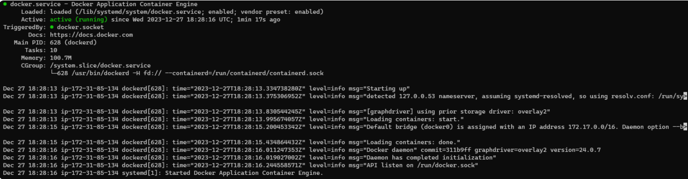
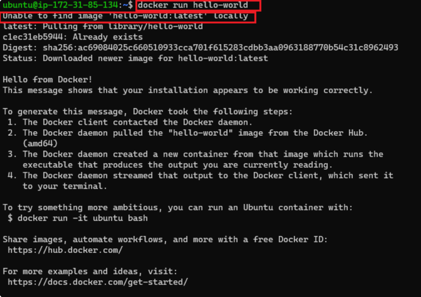
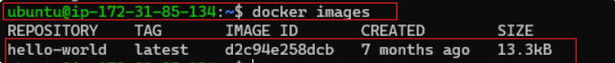

# Getting Started With Docker
## Installing Docker

We need to launch an ubuntu 20.02 LTS instance and connect to it, thhen follow the steps below.

Before installing Docker Engine for the first time on a new host machine, it is necessary to configure the Docker repository. Following this setup, we can proceed to install and update Docker directly from the repository.

***Now let's first add Docker's official GPG key***

`sudo apt-get update`

This is a Linux command that refreshes the package list on a Debian-based system, ensuring the lastest software information is available for installation.

`sudo apt-get install ca-certificates curl gnupg`

This is a Linux command that installls essential packages including certificate authoorities, a data transfer tool (curl), and the GNU Privacy Guard for secure communication and package verification.

`sudo install -m 0755 -d /etc/apt/keyrings`

The command above creates a directory (/etc/apt/keystrings) with specific permisions (0755) for storing keyring files, which are used for docker's authentication

`curl -fsSL https://download.docker.com/linux/ubuntu/gpg | sudo gpg --dearmor -o /etc/apt/keyrings/docker.gpg`

This downloads the Docker GPG key using **`curl`**

`sudo chmod a+r /etc/apt/keyrings/docker.gpg`

Sets read permissions for all users on the Docker GPG key file within the APT keyring directory

***Let's add the repository to Apt sources***

```
echo \
  "deb [arch=$(dpkg --print-architecture) signed-by=/etc/apt/keyrings/docker.gpg] https://download.docker.com/linux/ubuntu \
  $(. /etc/os-release && echo "$VERSION_CODENAME") stable" | \
  sudo tee /etc/apt/sources.list.d/docker.list > /dev/null
```

The "echo" command creates a Docker APT repository configuration entry for the Ubuntu system, incorporating the system architecture and Docker GPG key, and then "sudo tee/etc/apt/sources.list.d/docker.list>/dev/null" writes this configuration to the "/etc/apt/source.list.d/docker.list" file.

`sudo apt-get update`

Installs latest version of Docker

`sudo apt-get install docker-ce docker-ce-cli containerd.io docker-buildx-plugin docker-compose-plugin`

Verify that docker has been successfully installed

`sudo systemctl status docker`



By default, after installing docker, it can only be run by root user or using `sudo` command. To run the docker command without sudo execute the command below

`sudo usermod -aG docker ubuntu`

After executing the command above, we can run docker command  without using superuser priviledges

### Running the "Hello World" Container

***Using the `docker run` Command***

The `docker run` command is the entry point to execute containers in Docker. It allows you to create and start a container based on a specified Docker image. The most straightforward example is the "Hello World" container, a minimalistic container that prints a greetung message when executed.

```
# Run the "Hello World" container
docker run hello-world
```



When you execute this command, Docker performs the following steps:

1. ***Pulls Image (if not available locally):*** Docker checks if the **hello-world** image is available locally. If not, it automatically pulls it from the Docker Hub, a centralized repository for Docker images.

2. ***Creates a Container:*** Docker creates a container based on the **hello-world** image. This container is an instance of the image, with its own isolated filesystem and runtime environment.

3. ***Starts the Container:*** The container is started, and it executes the predefined command in the **hello-world** image, which prints a friendly message.

**Understanding the Docker Image and Container Lifecycle**

**Docker Image:** A Docker image is a lightweight, standalone, and executable package that includes everything needed to run a piece of software, including the code, runtime, libraries, and system tools. Images are immutable, meaning they cannot be modified once created. Changes result in the creation of a new image.

**Container Lifecycle:** Containers are running instances of Docker images.

* They have a lifecycle: **create, start, stop, and delete**.

* Once a container is created from an image, it can be started, stopped, and restarted.

***Verifying the Successful Execution***

You can check if the images is now in your local environment with Example Output:

`docker images`



If you encounter any issues, ensure that docker is properly installed and that your user has the necessary permissions to run Docker commands.

This simple "Hello World" example servers as a basic introduction to running containers with Docker. It helps verify that your Docker environment is set up correctly and provides insight into the image and container lifecycle. As leverage Docker for building, deploying, and managing diverse applications.

## Basic Docker Commands
***Docker Run***

The `docker run` command is fundamental for executing containers. it creates and starts a container based on a specified image.

```
# Run a container based on the "nginx" image
docker run hello-world
```

This example pulls the "nginx" image from Docker Hub (if not available locally) and starts a container using that image.

***Docker Ps***

The `docker ps` command displays a list of running containers. This is useful for monitoring active containers and obtaining information such as container IDs, names and status.

```
# List running containers
docker ps
```

to viwe all containers, including those that have stopped, add the `-a` option:

```
# List all containers (running and stopped)
docker ps -a
```

***Docker Stop***

The `docker stop` command halts a running container.

```
# Stop a running container (replace CONTAINER_ID with the container ID)
docker stop CONTAINER_ID
```

***Docker Pull***

The `docker pull` command downloads a Docker image from a registry, such as Docker Hub, to your local machine.

```
# Pull the latest version of the "ubuntu" image from Docker
docker pull ubuntu
```

***Docker Push***

The `docker push` command uploads a local Docker image to a registry, making it available for others to pull.

```
# push a local image to Docker Hub
docker push your-username/image-name
```

Ensure you've logged in to Docker Hub using `docker login` before pushing images.

***Docker Images***

The `docker images` command lists all locally available Docker images.

```
# List all local Docker images
docker images
```

***Docker RMI***

The `docker rmi` command removes one or more images from the local machine.

```
#Remover a Docker image (replace IMAGE_ID with the actual image ID)
docker rmi IMAGE_ID
```
