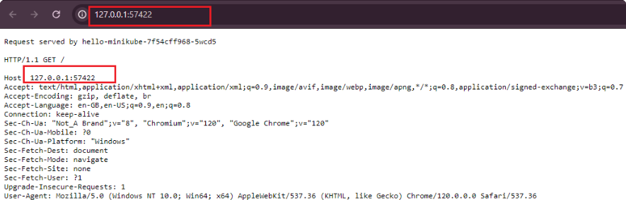

# Working with Kubernetes Resources

## Introducrion to YAML

A Kubernetes YAML file is a text file written in YAML syntax that describes and defines Kubernetes resources. YAML is a human-readable data serialization format that is commonly used for configuration files. In the context of kubernetes, these YAML files serve as a declarative way to specify the desired state of the resources such as pods, container, service and deployment you want to deploy and manage within a kubernetes cluster.

### Basic Structure of YAML File

YAML uses indentation to represent the hierachy of data, and it uses whitespace (usually spaces, not tabs) for indentation.

```
key1: value1
key2:
  subkey1: subvalue1
  subkey2: subvalue2
key3:
  - item1
  - item2
```

### Data Types

#### Scalars
Scalars are single Values.

* Strings:

    `name: John Doe`

* Numbers:
    
    `age: 25`

* Booleans:

    `is_student: true`

#### Collections

* Lists (arrays):

    ```
    fruits:
    - apple
    - banana
    - orange
    ```

* Maps (Key-value pairs):

    ```
    person:
    name: Alice
    age: 30
    ```

#### Nested Structures

YAML allows nesting of structures:

```
employee:
    name: John Doe
    position: developer
    skills:
        - Python
        - JavaScript
```

#### Comments

In Yaml, comments start with '#'

```
# This is a comment
key: value
```

#### Multiline strings

Multiline strungs can be represented using the **'|'** or **'>'** characters

```
description: |
  This is a multiline
  string in YAML.
```

#### Anchors and Aliases

YAML provides a mechanism to reuse data within the same document using anchors (&) and aliases (*). This feature helps reduce redundancy and maintain consistency.
	•	Anchor (&): Assigns a reference (or “label”) to a value.
	•	Alias (*): Refers to the value assigned to an anchor, effectively reusing it.

##### Basic Example

```yaml
person1: &john
  name: John Doe
  age: 30
  job: Engineer

person2:
  <<: *john  # Reuse John’s data
  age: 25    # Override age
```

**Explanation**

	1.	&john anchors the data (name, age, job) under person1.
	2.	*john aliases (reuses) the anchored data in person2.
	3.	age: 25 overrides the age field while keeping the rest of the data intact.

Final Data Structure (after alias resolution)

```yaml
person1:
  name: John Doe
  age: 30
  job: Engineer

person2:
  name: John Doe
  age: 25
  job: Engineer
```

##### Use Cases of Anchors and Aliases

1. Avoiding Repetition

Instead of duplicating data:

```yaml
server1:
  host: example.com
  port: 8080
  protocol: https

server2:
  host: example.com
  port: 8080
  protocol: https
```

You can write:

```yaml
server1: &default_server
  host: example.com
  port: 8080
  protocol: https

server2:
  <<: *default_server  # Reuse everything
```

2. Modifying Specific Fields

```yaml 
server1: &default_server
  host: example.com
  port: 8080
  protocol: https

server2:
  <<: *default_server
  port: 9090  # Override port
```

##### Anchors and Aliases in Lists

YAML allows anchors and aliases inside lists too:

```yaml
developers:
  - &alice
    name: Alice
    role: Backend Developer

  - &bob
    name: Bob
    role: Frontend Developer

team_lead:
  <<: *alice
  role: Lead Developer  # Override role
```

**Final Data Structure**

```yaml
developers:
  - name: Alice
    role: Backend Developer
  - name: Bob
    role: Frontend Developer

team_lead:
  name: Alice
  role: Lead Developer
```

##### Merging Multiple Aliases (<<)

The << key allows merging multiple anchors:

```yaml
defaults: &defaults
  os: Linux
  editor: VS Code

user_settings:
  <<: *defaults
  editor: Vim  # Override editor
```

Result

```yaml
user_settings:
  os: Linux
  editor: Vim
```

Now that we have got the basics, practice writing and reading YAML to become comfortable with its syntax. It's widely used in configuratuin files for various tools and systems.

## Depoying Applications in Kubernertes

In kubernetes, deploying applications is a fundamental skill that every beginner needs to grasp. Deployment involves the process of taking your appication code and running it on a kubernetes cluster, ensuring that it scales, manages resources efficiently, and stays resilient. This hands-on project will guide you through deploying your first application using Minikube, a lightweight, single-node kubernetes cluster perfect for beginners.

### Deploymemt in Kubernetes**

In Kubernetes, a Deployment is a declarative approach to managing and scaling applications. It provides a blueprint for the desired state of your application, allowing Kubernetes to handle the complexities of deploying and managing replicas. Whether you re running a simple web server or a more complex microservices architecture, Deployments are the cornerstone for maintaining application consistency and availability.

### Services in Kubernetes:

Once your application is deployed, it needs a way to be accessed by other parts of your system or external users. This is where Services come into play. In Kubernetes, a Service is an abstraction that defines a logical set of Pods and a policy by which to access them. It acts as a stable endpoint to connect to your application, allowing for easy communication within the cluster or from external sources. Some of the several types of Services in Kubernetes;

***- ClusterIP:*** Purpose: The default type. Exposes the Service on a cluster-internal IP. Accessible only within the cluster.

***- NodePort:*** Exposes the Service on each Node's IP at a static port (NodePort). Accessible externally using "NodeIP*

***- LoadBalancer:*** Exposes the Service externally using a cloud provider's load balancer. Accessible externally through the load balancer's IP.

In subsequent sections, we will dive deep into deployment strategies and service configurations within the Kubernetes ecosystem, delving into the intricacies of these components to ensure a thorough understanding and proficiency in their utilization.

### Deploying a Minikube Sample Application 

Using YAML files for deployments and services in Kubernetes is like crafting a detailed plan for your application, while direct deployment with **`kubectl`** commands is more like giving quick, on-the-spot instructions to launch and manage your application. Let's create a minikube deployment and service with `kubectl`

`kubectl create deployment hello-minikube --image=kicbase/echo-server:1.0
`

This command above creates a Kubernetes Deployment named "hello-miikube" running the "kicbase/echo-server:1.0" container image

`kubectl expose deployment hello-minikube --type=NodePort --port=8080`

The command above exposes the Kubernetes Deployment named "hello-minikube" as a  NodePort service on port 8080

`kubectl get services hello-minikube`


The easiest way to access the service is to let minikube launch a web browser for you

`minikube service hello-minkube`

 

### Working With YAML Files

Let's recall our docker foundations project when we pushed an image we buil to docker hub. Now let's reuse our image in the yaml script for deployment.

***i.*** Create a new folder ***'my-nginx-yaml'***

***ii.*** Create a new file ***'nginx-deployment.yaml'*** and paste the content below

```yaml
apiVersion: apps/v1
kind: Deployment
metadata:
  name: my-nginx-deployment
spec:
  replicas: 1
  selector:
    matchLabels:
      app: my-nginx
  template:
    metadata:
      labels:
        app: my-nginx
    spec:
      containers:
      - name: my-nginx
        image: dareyregistry/my-nginx:1.0
        ports:
        - containerPort: 80
```

The provided YAML snippet defines a Kubernetes Deployment for deploying an instance of the Nginx web server. Let's break down the key components:

***apiVersion: apps/ v1:*** Specifies the Kubernetes API version for the object being created, in this case, a Deployment in the "apps" group.

***kind:*** Deployment: Defines the type of Kubernetes resource being created, which is a Deployment. Deployments are used to manage the deployment and scaling of applications.

***metadata:*** Contains metadata for the Deployment, including the name of the Deployment, which is set to "my-nginx-deployment."

***spec:*** Describes the desired state of the Deployment.
replicas: 1: Specifies that the desired number of replicas (instances) of the Pods controlled by this Deployment is 1.

***selector:*** Defines how the Deployment selects which Pods to manage. In this case, it uses the label "app: my-nginx" to match Pods.

***template:*** Specifies the template for creating new Pods.

***metadata:*** Contains labels for the Pods, and in this case, the label is set to "app: my-nginx."

***spec:*** Describes the Pod specification.

***containers:*** Defines the containers within the Pod.

***name:*** my-nginx: Sets the name of the container to "my-nginx."

***image: dareyregistry/my-nginx:1.0:*** Dpecifies the Docker image to be used for the Nginx conntainer. The image is "ridwanaz/my-nginx" with version "1.0."

**Note: You can replace the image with your own image.**

***ports:*** Specifies the port mapping for the container, and in this case, it exposes port 80.

***iii.*** Create a new file called ***nginx-service.yaml*** and paste the content below.

```yaml
apiVersion: v1
kind: Service
metadata:
  name: my-nginx-service
spec:
  selector:
    app: my-nginx
  ports:
    - protocol: TCP
      port: 80
      targetPort: 80
  type: NodePort
```

The provided YAML snippet defines a Kubernetes Service for exposing the Nginx application to the external world. Let's break down the key components:

***apiVersion: vl:*** Specifies the Kubernetes API version for the object being created, in this case, a Service.

***kind:*** Service: Defines the type of Kubernetes resource being created, which is a Service.Services provide a stable endpoint for accessing a set of Pods.

***metadata:*** Contains metadata for the Service, including the name of the Service, which is set to "my-nginx-service."

***spec:*** Describes the desired state of the Service.

***selector:*** Specifies the labels used to select which Pods the Service will route traffic to. In this case, it selects Pods with the label "app: my-nginx."

***ports:*** Specifies the ports configuration for the Service.

***protocol: TCP:*** Specifies the transport layer protocol, which is TCP in this case.

***port: 80:*** Defines the port on which the Service will be exposed.

***targetPort: 80:*** Specifies the port on the Pods to which the traffic will be forwarded.

***type: NodePort:*** Sets the type of the Service to NodePort. This means that the Service will be accessible externally on each Node's IP address at a static port, which will be automatically assigned unless specified.

***iv.*** Run the command below for the deployment on the cluster

```
kubectl apply -f nginx-deployment.yaml

kubectl apply -f nginx-service.yaml
```


***v.*** Verify for deployment

```
kubectl get deployments

kubectl get services
```


***vi.*** Access your deployment on web browser

`minikube service my-nginx-service --url`

Follow the ip address to access your application on the web browser


