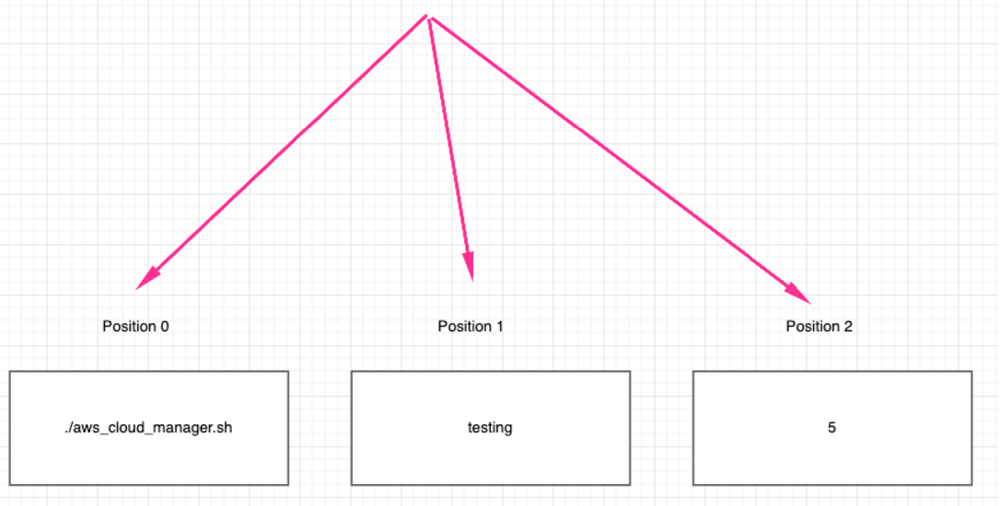

# Understanding Environment Variables & Infrastructure Environments: Key Differences

As we delve deeper into the world of technology and its building blocks, two essential concepts often come to the forefront: "Infrastructure Environments" and "Environment Variables." Despite both terms featuring "Environment", they play distinct roles in the realm of scripting and software development. This common terminology can lead to confusion, making it crucial to distinguish and understand each concept from the outset.

### Infrastructure Environments

Infrastructure environments refer to the various settings where software applications are developed, tested, and deployed, each serving a unique purpose in the software lifecycle.

Lets say you are working with a development team to build a FinTech product. They have 2 different AWS accounts. The journey would be something like;

1. ***VirtualBox + Ubuntu:*** The development environment where all local development is done on your laptop

2. ***AWS Account 1:*** The testing environment where, after local development is completed, the code is pushed to an EC2 instance here for further testing

3. ***AWS Account 2:*** The production environment, where after tests are completed in ***AWS Account 1***, the code is pushed to an EC2 instance in ***AWS Account 2***, where the customers consume the Fintech product through a website.

Each setup is considered as an ***Infrastructure Environment***

On the other hand, environment variables are key-value pairs used in scripts or computer code to manage configuration values and control software behavior dynamically.

### Environment Variables

Imagine your FinTech product needs to connect to a database to fetch financial data. However, the details of this database connection, like the database **URL**, **username**, and **password** differ between your **development**, **testing**, and **production** environments.

If you need to develop a shell script that will be reused across all the 3 different environmets, then it is important to dynamically fetch the correct value for your connectivity to those environments.

Here's how environment variables come into play:

***Development Environment (VirtualBox + Ubuntu):***

***Environment Variables:***
* DB_URL=localhost
* DB_USER=test_user
* DB_PASS=test_pass

Here, the environment variables point to a local database on vour laptop where vou can safely experiment without afffecting real or test data.

***Testing Environment (AWS Account 1):***

***Environment Variables:***

* DB_URL=testing-db.example.com
* DB_USER=testing_user
* DB_PASS=testing_pass

In this environment, the variables are configured to connect to a remote database dedicated to testing. This ensures that tests are performed in a controlled environment that simulates production settings without risking actual customer data.

***Production Environment (AWS Account 2):***

***Environment Variables:***

* DB_URL=production-db.example.com
* DB_USER=prod_user
* DB_PASS=prod_pass

Finally, when the application is running in the production environment, the environment variables switch to ensure the application connects to the live database. This is where real customer interactions happen, and the data needs to be accurate and secure.

By clarifying these differences early on, we set a solid foundation for navigating the complexities of technology development with greater ease and precision.

Now lets begin developing our shell script to manage cloud infrastructure.

### aws_cloud_manager.sh script

By the end of this mini project, we would have started working on the ***aws_cloud_manager.sh*** script where environment variables will be defined, and command line arguments are added to control if the script should run for local environment, testing or production environment.

Developing a shell script is usually done by starting with incremental changes.

Lets begin by creating environment variable to determine if the script is running local, testing, or production environment.

* If you are on Mac, open up your Mac Terminal

* If you are on Windows, login to your Ubuntu desktop in virtual box and open the terminal

* If you don't use lirtual box, spin up an EC2 instance and name it local so it represents your local environment, then login to it.

* Create a shell script with the name ***aws_cloud_manager.sh***

* Put the code below into the file

```
#!/bin/bash

# Checking and acting on the environment variable
if [ "$ENVIRONMENT" == "local" ]; then
echo "Running script for Local Environment..."
# Commands for local environment
elif [ "$ENVIRONMENT" == "testing" ]; then
echo "Running script for Testing Environment..."
# Commands for testing environment
elif [ "$ENVIRONMENT" == "production" ]; then
echo "Running script for Production Environment..."
# Commands for production environment
else
echo "No environment specified or recognized."
exit 2
fi
```

* GIve it the relevant permission to execute on your local terminal

`sudo chmod +x aws_cloud_manager.sh`

* Without running the script, can you explain what the code is doing?

If you execute this as it is, the execution should go into the else block just because there is no ***$Environment*** variable set.

what if you type this on your terminal

`export ENVIRONMENT=production`

Then run the script again. Tou should get an output that says;


Now, you can see how environment variables can be used to dynamically apply logic in the script based on the requirement you are trying to satisfy.

The ***export*** command is used to set key and values for environment variables.

You can also set the variable directly within the script. For example if the script was like this,

```
#!/bin/bash

# Initialize environment variable
ENVIRONMENT="testing"

# Checking and acting on the environment variable
if [ "$ENVIRONMENT" == "local" ]; then
  echo "Running script for Local Environment..."
  # Commands for local environment
elif [ "$ENVIRONMENT" == "testing" ]; then
  echo "Running script for Testing Environment..."
  # Commands for testing environment
elif [ "$ENVIRONMENT" == "production" ]; then
  echo "Running script for Production Environment..."
  # Commands for production environment
else
  echo "No environment specified or recognized."
  exit 2
fi
```

Running this version of the script would mean everytime you run it, it will consider the logic for testing environment. Because the value has been "hard coded" in the script, and that is no longer dynamic.

The best way to do this would be to use command line arguments.

### Positional parameters in Shell Scripting

As we've learned, hard-coding values directly into scripts is considered poor practice. Instead, we aim for flexibility by allowing scripts to accept input dynamically. This is where positional parameters come in - a capability in shell scripting that enables passing arguments to scripts at runtime, and then replaces the argument with the parameter inside the script.

* The argument passed to the script is the value that is provided at runtime.

As in the case of the below where the argument is "testing", and it is also the value to the variable within the script.

`./aws_cloud_manager.sh testing`

* Inside the script we will have this;

`ENVIRONMENT=$1`

**`$1`** is the positional parameter which will be replaces by the argument passed to the script.

Because it is possible to pass multiple parameters to a script, dollar sign **`$`** is used to prefix the position of the argument passed to the script. Imagine if another variable within the script is called ***NUMBER_OF_INSTANCES*** that determines how many EC2 instances get provisioned, then calling the script might look like;

`./aws_cloud_manager.sh testing 5`

The positional parameters inside the script would look like

```
ENVIRONMENT=$1
NUMBER_OF_INSTANCES=$2
```
* Each positional parameter within the script corresponds to a specific argument passed to the script, and each parameter has a position represented by an index number.

In the case of 

`./aws_cloud_manager.sh testing 5`

We have two positional parameters.



Notice that the script itself is in position "0"

### Condition to check the number of arguments

Creating shell scripts to meet specific requirements is one aspect of development, but ensuring their cleanliness and freedom from bugs is equally crucial. Integrating logical checks periodically to validate data is considered a best practice in script development.

A prime example of this is verifying the number of arguments passed to the script, ensuring that the script receives the correct input required for its execution, and providing clear guidance to users in case of incorrect usage.

Below code ensures that when the script is executed, exactly 1 argument is passed to it, otherwise it fails with an exit code of 1 and an shows a message telling the user how to use the script.

```
# Checking the number of arguments
if [ "$#" -ne 0 ]; then
    echo "Usage: $0 <environment>"
    exit 1
fi
```

* "$#" is The special variable that holds the number of arguments passed to the script.
* "-ne" means "Not equal"
* "$0" represents the positional parameter of 0, which is the script itself.

Hence, if number of arguments is not equal to "1", then show the echo message.

An updated sccript would look like this;

```
#!/bin/bash

# Checking the number of arguments
if [ "$#" -ne 1 ]; then
    echo "Usage: $0 <environment>"
    exit 1
fi

# Accessing the first argument
ENVIRONMENT=$1

# Acting based on the argument value
if [ "$ENVIRONMENT" == "local" ]; then
  echo "Running script for Local Environment..."
elif [ "$ENVIRONMENT" == "testing" ]; then
  echo "Running script for Testing Environment..."
elif [ "$ENVIRONMENT" == "production" ]; then
  echo "Running script for Production Environment..."
else
  echo "Invalid environment specified. Please use 'local', 'testing', or 'production'."
  exit 2
fi
```


